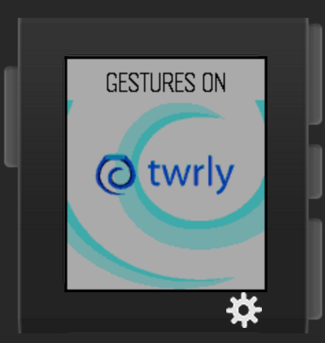
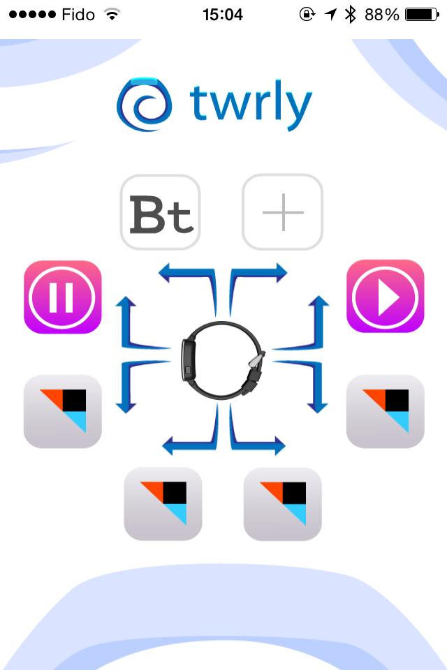

Twrly - BattleHack 2015 Toronto Hackathon Project
=================================================

Twrly is a gesture recognition controller for the Pebble Time smartwatch.

Make phone calls, control your music player, and trigger [IFTTT](https://ifttt.com/) actions, all using simple arm gestures!

Make seamless payments with a flick of the wrist, with the power of the BrainTree API.

Made in 24 hours at [BattleHack Toronto](https://2015.battlehack.org/toronto)!

For the sake of completeness, here's a picture of a fox:

Screenshots
-----------

Gesture recognizer for the Pebble Time:

iOS app controller:

Technical Overview
------------------

* The Pebble app contains the gesture recognizer and accelerometer controller, implemented in pure C using Basalt/Pebble SDK v3.
* The iOS app is linked to the Pebble app, and consumes incoming gesture results to control the phone, post updates to IFTTT via the feed server, and make payments via the payment server.
* The feed server allows users to subscribe to gestures using IFTTT via per-user RSS feeds - the app posts updates to the feed server, which updates the user's feed.
* The payment server handles payments via BrainTree, processing transactions made from the iOS app.
